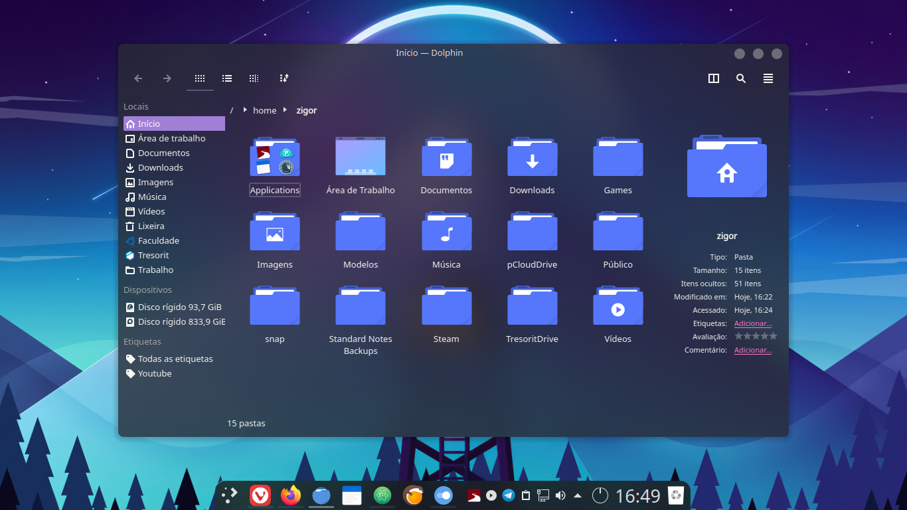

This is Dracula kde a theme for Plasma with Dracula theme color palette and based on Layan Kde

In this repository you find:

- Aurorae Themes
- Kvantum Themes
- Plasma Color Schemes
- Plasma Desktop Themes

## Donate

If you want to make a donate to the creator of Layan Kde

## License

GNU GPL v3

## Referencias
Palettes:

https://github.com/dracula/dracula-theme

Moulds:

#Your biggest base is made in it with only color change

https://github.com/vinceliuice/Layan-kde

#Based to make the Desktoptheme

https://github.com/vinceliuice/ChromeOS-kde

#Color Schemes just made a single change

https://store.kde.org/p/1249119

#Aurorae Dracula-kde-rounded based
https://github.com/vinceliuice/WhiteSur-kde

## Preview

